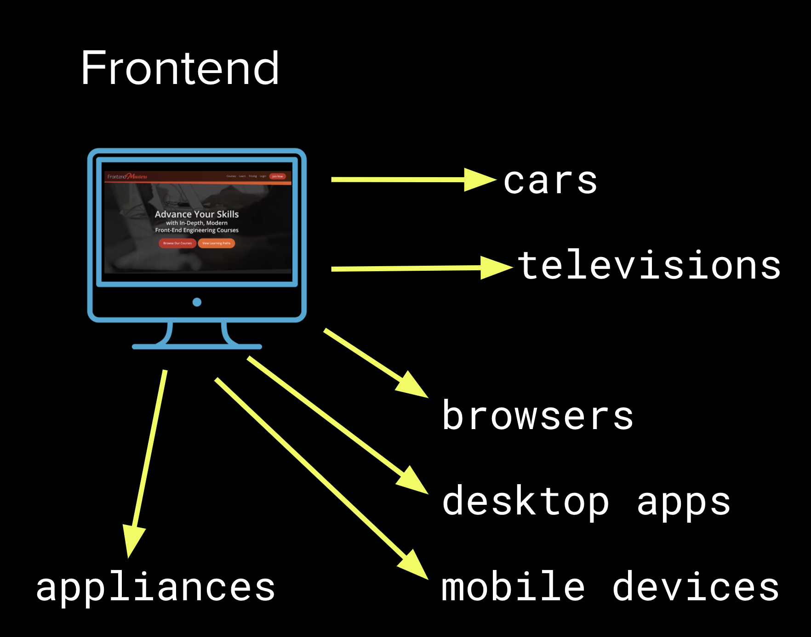
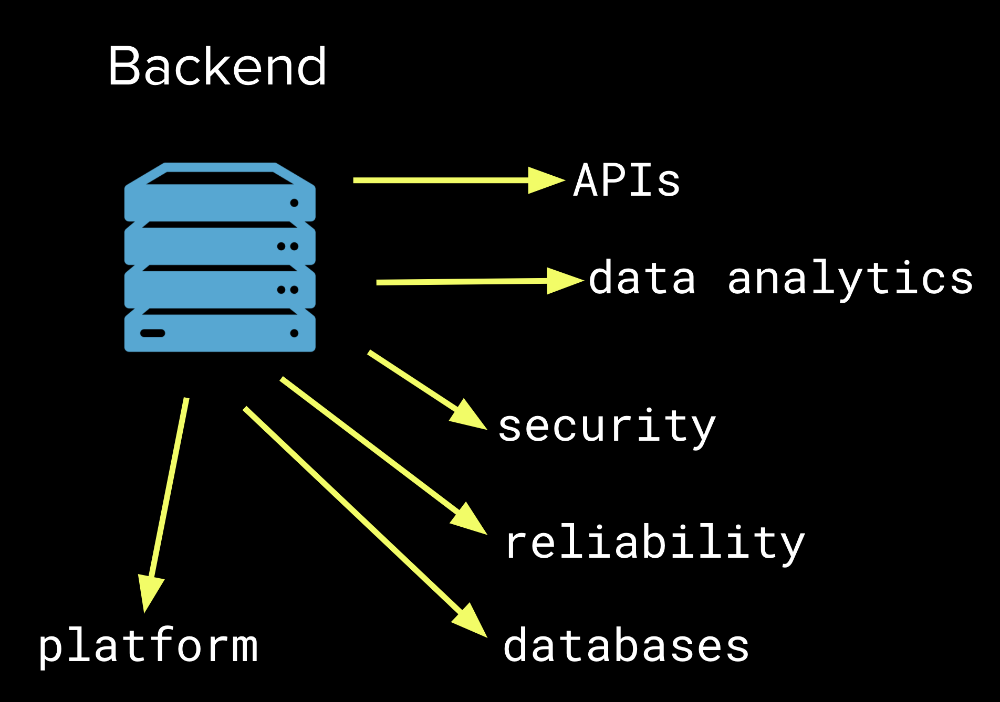
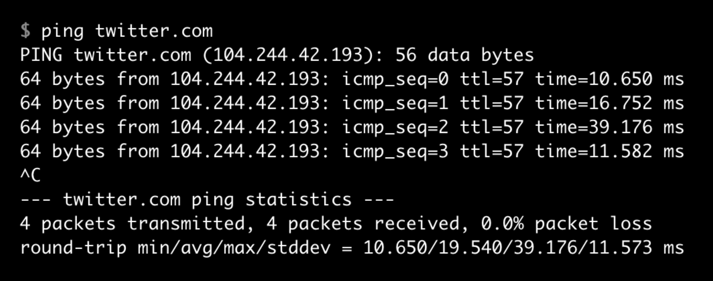
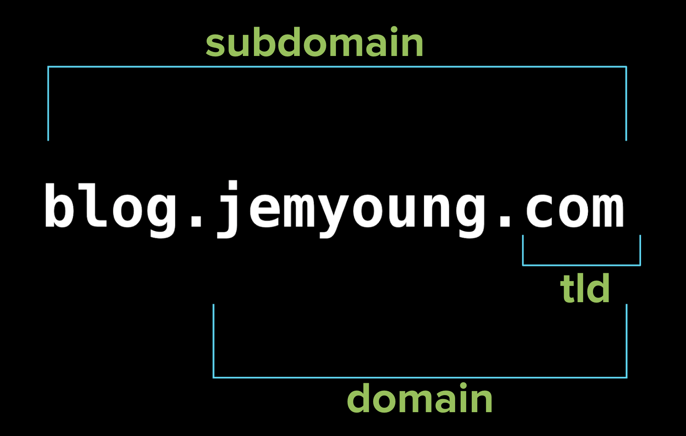
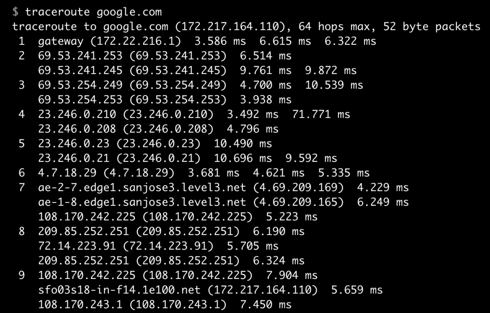
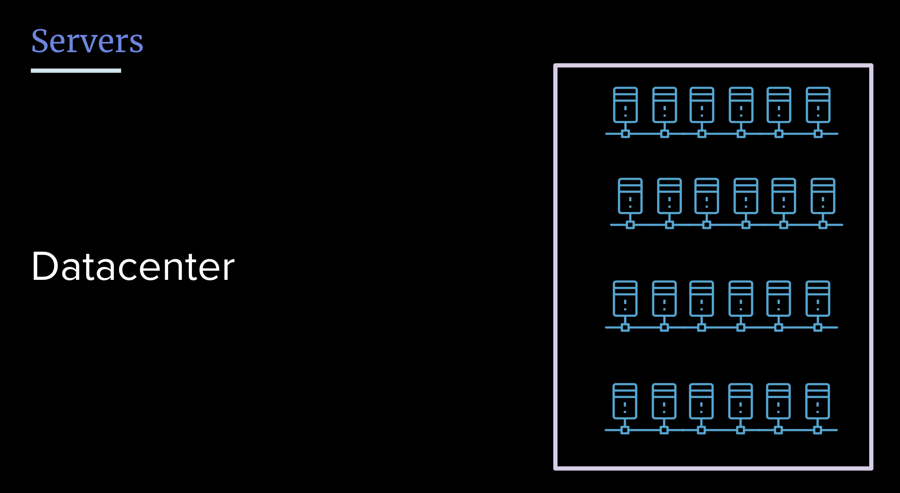
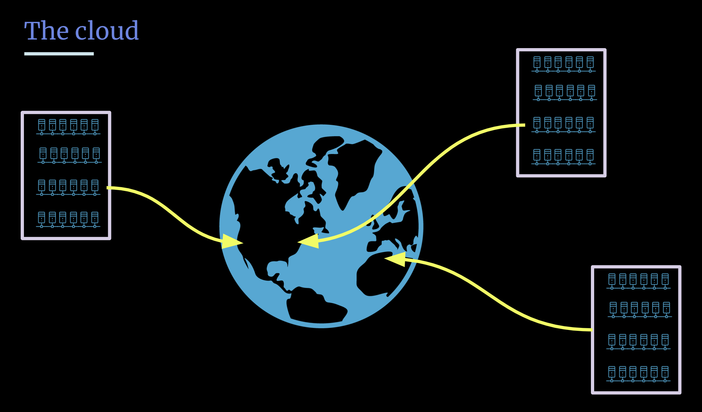
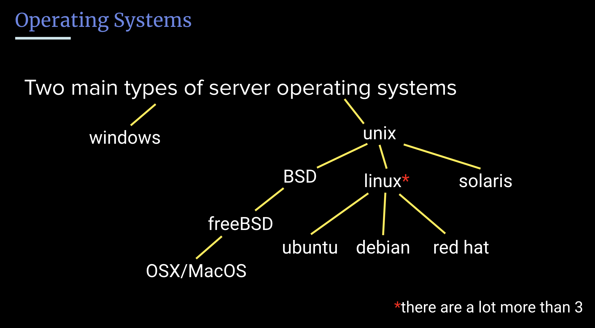
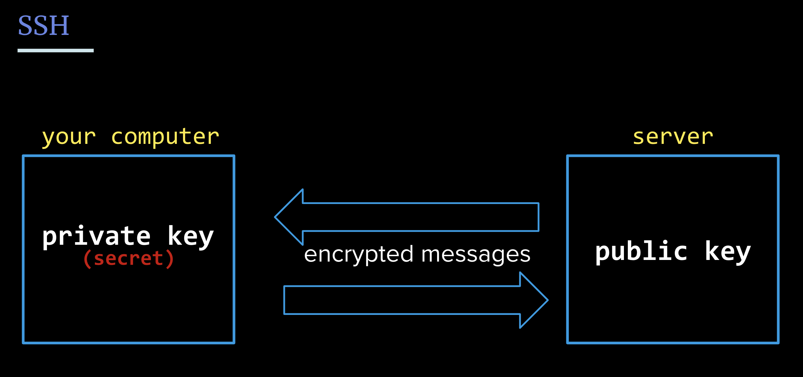

# Summary of Full Stack for Front-End Engineers, v2
Summary of Full Stack for Front-End Engineers, v2 by Jem Young. The goal of this class to learn to move back and forth between UI and the back-end through the command line, SSH, nginx, docker containers, server security, HTTP/2, HTTP/3 and more.

# Introduction
### What is Fullstack
Someone who can build an application from start to finish, including front end and backend.

### Why Fullstack
You can master all the techniques involved in a development project. You can make a prototype very rapidly. You can provide help to all the team members.

Full stack developers ensure the openness of application and they also work alongside graphic designers as well for features of web design and many other tasks. They are necessary to look into web projects from the start to its final form.

### Command Line
Every operating system have command line, whether its windows, mac or linux. Its consistent, the command line always gonna be the same. 
- Fast
- Consistent
- Easier to automate

Command line are important because not all server have a GUI (Graphical User Interface) and theres no limitation, no matter how well designed the GUI you cannot encompass all the possibilities. Some example of more familiar command line :
- `cd` - change directory
- `ls` - list directory content
- `pwd` - print working directory
- `mkdir` - make directory
- `rmdir` - remove directory
- `cat` - show file contents
- `man` - command manual
- `less` - show file contents by page
- `rm` - remove file
- `echo` - repeat input

### Shells
Is the one that included with a lot of UNIX systems by default but it basically allows you to run command lines, and run a lot of the basic systems that come along with UNIX. 
- shells - Command intepreter to interface with systems
- terminal - runs shells application

The shells is just a frontline that is the user interface of some sorts, and it just talk to the application or the OS which talk to the kernel, and the kernel is the core of operating system.

# Understanding the Internet
It works by using a packet routing network that follows Internet Protocol (IP) and Transport Control Protocol (TCP) [5]. TCP and IP work together to ensure that data transmission across the internet is consistent and reliable, no matter which device you're using or where you're using it. Basically a series of system globally interconnected devices. Not to be confused with intranet, which basically internet but private.

Some list to understand the internet better :
- internet - A system of globally interconnected devices
- intranet - Private internet
- IP - Internet Protocol
- IP Address - A label assigned to an internet connected device
- IPv4 - It is the underlying technology that makes it possible for us to connect our devices to the web. Whenever a device accesses the Internet, it is assigned a unique, numerical IP address such as `8.8.8.8`.
- IPv6 - is the most recent version of the Internet Protocol (IP), the communications protocol that provides an identification and location system for computers on networks and routes traffic across the Internet. IPv6 addresses are represented as eight groups of four hexadecimal digits each, separated by colons such as `2001:4860:4860:8888`
- TCP - Transmission Control Protocol
- UDP - User Datagram Protocol
- DNS - Domain Name System
- Nameservers - Map domains to IP addresses
- ICMP - Internet Control Message Protocol is a network layer protocol used by network devices to diagnose network communication issues.
- Packets - a packet that contain the smallest bit of information you can transmit.

# Servers
It serves content and also respond request, it serves something back.
### VIM
Vim is a free and open-source, screen-based text editor program for Unix. It is an improved clone of Bill Joy's vi. Some more vim [command cheat sheets](https://linuxmoz.com/vi-commands-cheat-sheet/)

### Data centers and the cloud
Servers generally live in place called data center, a place full or racks of machine in a really cold environments. So a data center is just this colletions of computers, often shared between application and/or different companies.

In cloud computing, elasticity is defined as "the degree to which a system is able to adapt to workload changes by provisioning and de-provisioning resources in an autonomic manner, such that at each point in time the available resources match the current demand as closely as possible.

When we size the servers it called the VPS (Virtual Private Server), which in reality just a piece of the servers. example of VPS [www.digitalocean.com](https://m.do.co/c/3bea45abfdb1)

### Operating Systems

### SSH
The Secure Shell Protocol is a cryptographic network protocol for operating network services securely over an unsecured network. Its most notable applications are remote login and command-line execution. SSH applications are based on a client–server architecture, connecting an SSH client instance with an SSH server.

